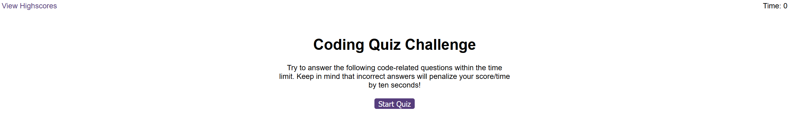
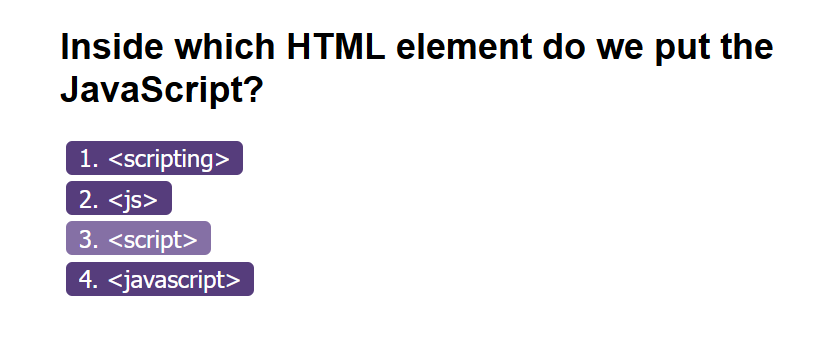
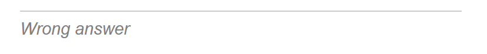
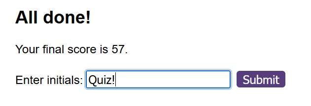
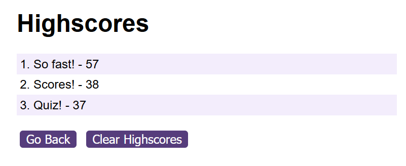

# coding test

# Description

An interactive, timed test that features several multiple choice questions for the user to select from. This quiz will save and display your highscores (time remaining at the end of quiz).
 
# Installation

Open the link in a modern browser (Tested on Firefox and Chrome): https://therandommer.github.io/Password-Generator/

# Usage

When you open the site in your browser you should see a site that looks like the screenshot below:

Click the "Start Quiz" button. Select the answer you think is correct. The website will inform you via sound and text if you got the answer right or not.
At the end of the quiz you will be directed to a high score page where you will be able to submit your high score and play again to try and beat it.

## The Quiz

## High Scores

## License

Using MIT License.